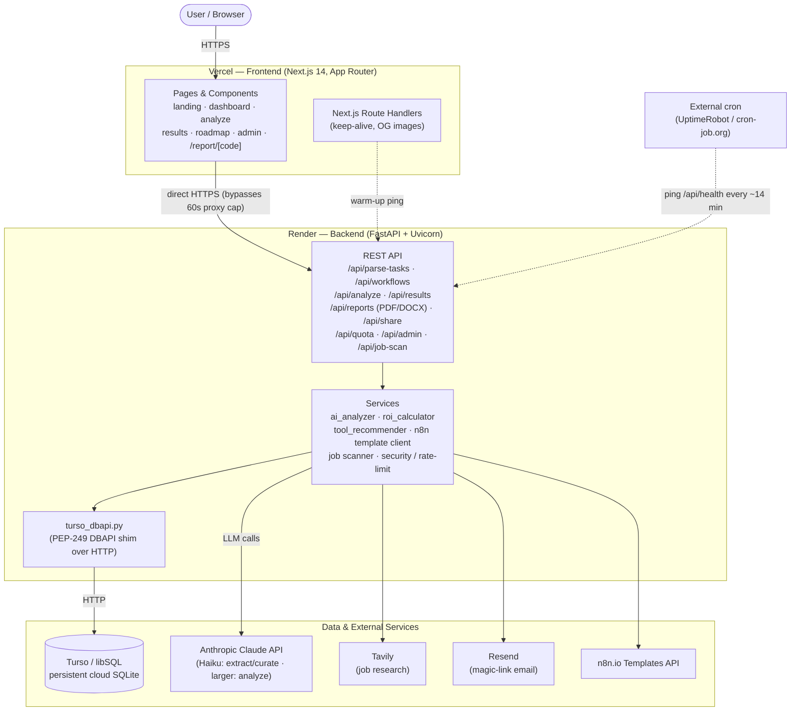
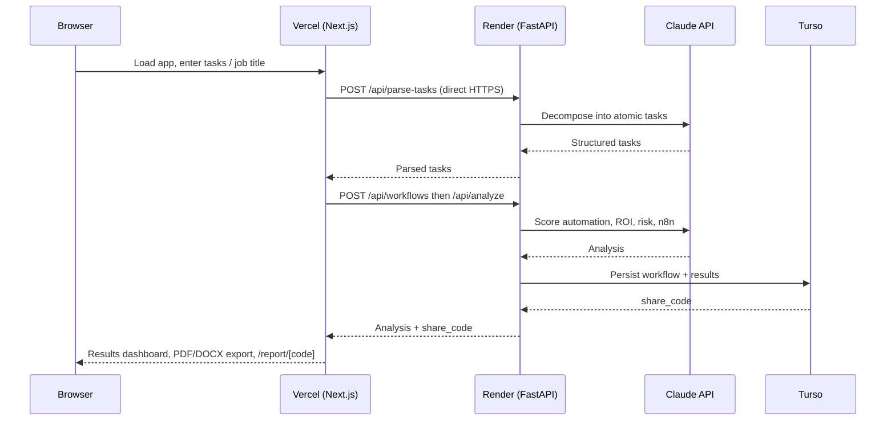

# WorkScanAI — Architecture

How the project is structured, deployed, and how a request flows end-to-end.

## Live deployment topology



## Request lifecycle (analyze flow)



## Why this shape

- **Frontend and backend are separate deployments.** The browser calls Render
  **directly** over HTTPS for any operation that may exceed Vercel's ~60s proxy
  limit (AI analysis, document extraction, email auth). Vercel serves only the
  Next.js app — there is no Python serverless function in production.
- **Render free tier sleeps after ~15 min idle** (≈30–50s cold start), so the UI
  shows progress feedback and an external cron pings the backend to keep it warm.
- **Turso/libSQL** gives persistent cloud SQLite that survives Render redeploys,
  accessed through a small custom DBAPI shim so all SQLAlchemy ORM code is unchanged.

## Repository layout

```
workscanai/
├── frontend/          Next.js 14 app (App Router) — deployed to Vercel
│   ├── src/app/       Routes: landing, dashboard, results, roadmap, admin, report
│   ├── src/components/ Shared UI (WorkflowForm, charts, badges, modals)
│   ├── src/lib/       API client + helpers
│   ├── Dockerfile     Image for optional local Docker stack
│   └── vercel.json    Vercel config (intentionally minimal)
├── backend/           FastAPI service — deployed to Render
│   ├── app/
│   │   ├── api/       Route handlers (workflows, analysis, reports, job-scan, admin)
│   │   ├── core/      config, database, turso_dbapi shim, security
│   │   ├── models/    SQLAlchemy models
│   │   └── services/  AI analyzer, ROI, tool recommender, n8n client
│   ├── scripts/       Backend maintenance utilities (seed, backfills, checks)
│   ├── tests/         Pytest suite (unit/integration)
│   └── Dockerfile     Image for optional local Docker stack
├── scripts/           Local dev convenience scripts (Windows setup/start helpers)
├── docker/            Optional offline full-stack dev (compose + local Postgres)
├── tests/             Deployed-system E2E probes + secret scans (whole-stack)
├── pics/              Logo, banner, screenshots
├── tasks/             Sample task inputs
├── render.yaml        Render service definition
└── README.MD          Project overview
```
