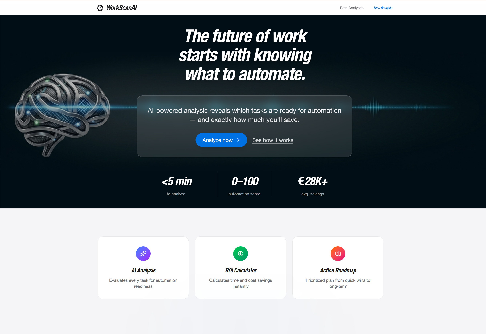

<div align="center">


# WorkScanAI

**AI-Powered Workflow Analysis for the Age of Automation**

[](https://www.python.org/)
[](https://nextjs.org/)
[](https://www.typescriptlang.org/)
[](https://fastapi.tiangolo.com/)
[](https://www.anthropic.com/)
[](https://www.docker.com/)
[](LICENSE)

*Submit your team's workflow → get a ranked automation plan with real ROI numbers in under 5 minutes.*

</div>

---

## Screenshots

| Landing Page | Workflow Input (Text, Voice, Document) |
|:---:|:---:|
|  |  |
| **Analysis Results & ROI** | **Implementation Roadmap** |
|  |  |

---

## The Problem

Companies are racing to adopt AI but most have no systematic way to answer the most important question:

> *Which of our tasks can be automated today, and what is the actual ROI?*

WorkScanAI answers that in minutes, not months.

---

## The Solution

Submit your team's tasks via **voice recording**, **document upload**, or **manual entry**.  
Receive a scored automation assessment, a concrete ROI projection, and a phased implementation roadmap.


### Key Features

| Feature | Description |
|---|---|
| 🎙️ **Voice Input** | Record tasks verbally — AI extracts and structures them automatically |
| 📄 **Document Upload** | Parse PDFs and Word docs to pull out task lists |
| ✍️ **Manual Entry** | Type tasks directly with add/remove controls |
| 🤖 **AI-Readiness Scoring** | 0–100 score per task based on automation potential |
| 💰 **ROI Calculator** | Annual savings, hours reclaimed, and payback period |
| 🗺️ **Implementation Roadmap** | Phased plan: quick wins → medium-term → long-term |
| 📊 **Visual Dashboard** | All your analyses in one place with aggregate stats |
| 📥 **Export** | Download full reports as DOCX or PDF |

---

## Tech Stack

| Layer | Technology | Purpose |
|---|---|---|
| **Frontend** | Next.js 14, TypeScript, Tailwind CSS | App Router, SSR, client components |
| **Backend** | Python 3.11, FastAPI | REST API, business logic, file handling |
| **AI / LLM** | Claude API (Anthropic) | Task extraction, scoring, recommendations |
| **Database** | SQLite (dev) → PostgreSQL (prod) | Workflow and results persistence |
| **Deployment** | Docker, Docker Compose | Containerised multi-service deployment |
| **CI/CD** | GitHub Actions | Automated build, test, deploy pipeline |

---

## Development Roadmap

### ✅ Phase 1 — Foundation (Complete)
- FastAPI backend with SQLite and full REST API
- AI analysis engine: task scoring, ROI calculation, tool recommendations
- Document upload and parsing (PDF, DOCX, CSV)
- Voice-to-text task extraction via Web Speech API
- Next.js 14 frontend with App Router, TypeScript, Tailwind CSS
- Dashboard, analyze page, results page, roadmap page

### ✅ Phase 2 — Frontend Polish (Complete)
- Apple-inspired design system throughout
- Voice recording with real-time transcription feedback
- Export to DOCX and PDF
- Global 404 page + analysis-specific not-found page
- Demo seed data (3 pre-analyzed industry workflows)
- Favicon, app icons (iOS + Android), Open Graph metadata

### 🔨 Phase 3 — Docker & Production (In Progress)
- Multi-service Docker Compose (frontend + backend + PostgreSQL)
- Migrate from SQLite to PostgreSQL
- GitHub Actions CI/CD pipeline
- Deploy to Railway / Render / DigitalOcean

### 📅 Phase 4 — Intelligence Layer (Planned)
- LangChain chains for multi-step agentic analysis
- Tool recommendation engine (Zapier, Make.com, UiPath, n8n)
- Industry benchmarking — compare against sector averages
- Risk assessment for compliance-sensitive tasks
- Streaming analysis with live progress updates
- Recharts visualisations: donut score chart, effort/impact matrix

---

## Getting Started

### Prerequisites

- Python 3.11+
- Node.js 18+
- An Anthropic API key — [get one here](https://console.anthropic.com/)
- Docker Desktop *(Phase 3, optional now)*

### Manual Setup (Recommended for Development)

**1. Clone**
```bash
git clone https://github.com/ibxibx/workscanai.git
cd workscanai
```


**2. Backend**
```bash
cd backend
python -m venv venv
venv\Scripts\activate        # Windows
# source venv/bin/activate   # macOS / Linux
pip install -r requirements.txt
```

Create `backend/.env`:
```env
ANTHROPIC_API_KEY=sk-ant-...
DATABASE_URL=sqlite:///./workscan.db
```

```bash
uvicorn app.main:app --reload --port 8000
```

**3. Frontend**
```bash
cd frontend
npm install
```

Create `frontend/.env.local`:
```env
NEXT_PUBLIC_API_URL=http://localhost:8000
```

```bash
npm run dev
```

**4. Open**
- App: http://localhost:3000
- API docs: http://localhost:8000/docs

### Load Demo Data

Seed 3 pre-analyzed industry workflows so the dashboard isn't empty:

```bash
cd backend
python seed_demo.py
```

Creates and fully analyses: **Marketing Operations**, **Customer Support**, **Finance & Accounting**.

---

## Docker (Phase 3 — Coming Soon)

Once containerised, the entire stack launches with one command:

```bash
docker compose up --build
```

Three containers spin up — Next.js frontend, FastAPI backend, PostgreSQL — networked automatically. No manual setup on any machine.

---

## Example Output

**Input:** Marketing team (social posts, scheduling, engagement, reports, research)

| Task | AI Score | Time Saved | Difficulty |
|---|---|---|---|
| Schedule posts | 92% | 90% | Easy |
| Generate reports | 88% | 85% | Easy |
| Write posts | 72% | 60% | Medium |
| Research topics | 65% | 50% | Medium |
| Respond to comments | 55% | 40% | Medium |

**Result → Automation score 74/100 · €28,000/yr saved · 436 hours reclaimed**

---

## Project Structure

```
workscanai/
├── backend/
│   ├── app/
│   │   ├── api/routes/      # FastAPI endpoints (workflows, analyze, results, reports)
│   │   ├── core/            # Config, database, dependencies
│   │   ├── models/          # SQLAlchemy ORM models
│   │   ├── schemas/         # Pydantic request/response schemas
│   │   └── services/        # AI analyser, ROI calculator, report generator
│   ├── seed_demo.py         # Seed 3 demo workflows with full AI analysis
│   └── requirements.txt
├── frontend/
│   ├── src/app/
│   │   ├── dashboard/       # Dashboard, results [id], roadmap pages
│   │   ├── not-found.tsx    # Global 404 page
│   │   ├── favicon.ico      # App icon (auto-detected by Next.js)
│   │   ├── icon.png         # 192×192 PWA icon
│   │   ├── apple-icon.png   # 180×180 iOS icon
│   │   └── page.tsx         # Landing page + workflow input form
│   └── src/components/
│       └── WorkflowForm.tsx # Voice, document, and manual entry
├── pics/                    # Screenshots and logo for README
└── docker-compose.yml       # Phase 3 — full-stack containers
```


## What You Learn Building This

| Skill | Where it appears in this project |
|---|---|
| **Next.js 14 App Router** | File-based routing, layouts, dynamic `[id]` routes, `not-found.tsx` |
| **Server vs Client Components** | Dashboard (server fetch) vs WorkflowForm (client state + voice API) |
| **TypeScript** | Interfaces, generics, strict typing across full stack |
| **FastAPI + SQLAlchemy** | REST API design, ORM models, relationship loading |
| **Claude API / LLM integration** | Prompt engineering, structured JSON responses, multi-step analysis |
| **Docker + Compose** | Multi-service containerisation, networking, environment vars, volumes |
| **GitHub Actions CI/CD** | Automated lint, test, build and deploy on every push |
| **PostgreSQL** | Production relational DB, Alembic migrations |
| **LangChain** | Agentic chains, document loaders, vector search (Phase 4) |

---

## Contributing

Contributions welcome — open an issue first to discuss.

**Ideas:** Recharts visualisations · User authentication · Industry benchmark data · LangChain chains · Playwright E2E tests

---

## License

MIT — see [LICENSE](LICENSE).

---

<div align="center">

Built by [Ian Baumeister](https://ianworks.dev) &nbsp;·&nbsp; [LinkedIn](https://linkedin.com/in/avoiann) &nbsp;·&nbsp; [GitHub](https://github.com/ibxibx)

**⭐ Star this repo if you find it useful!**

</div>
