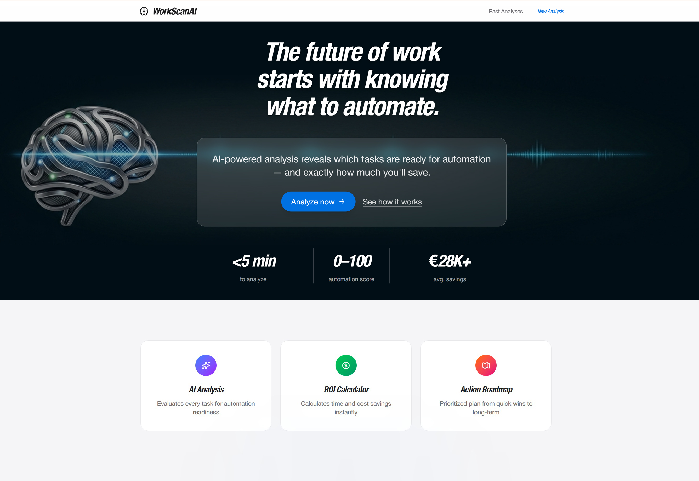
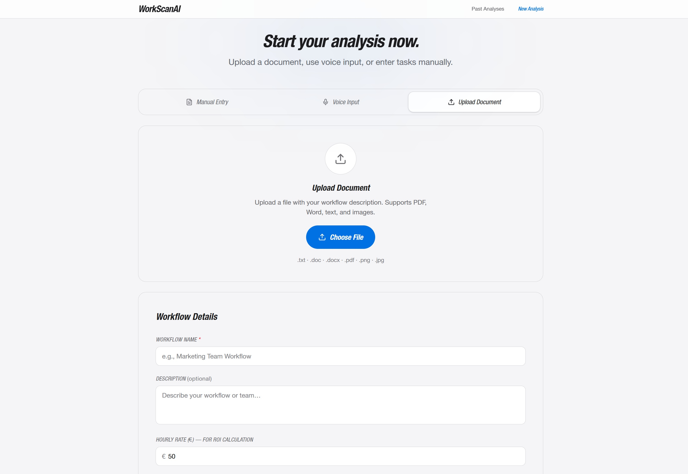
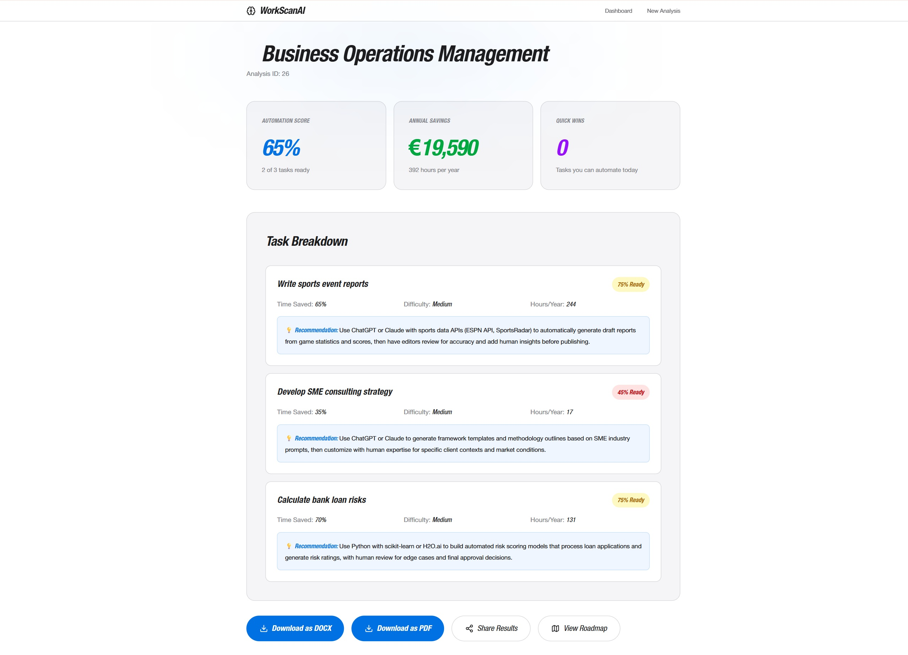
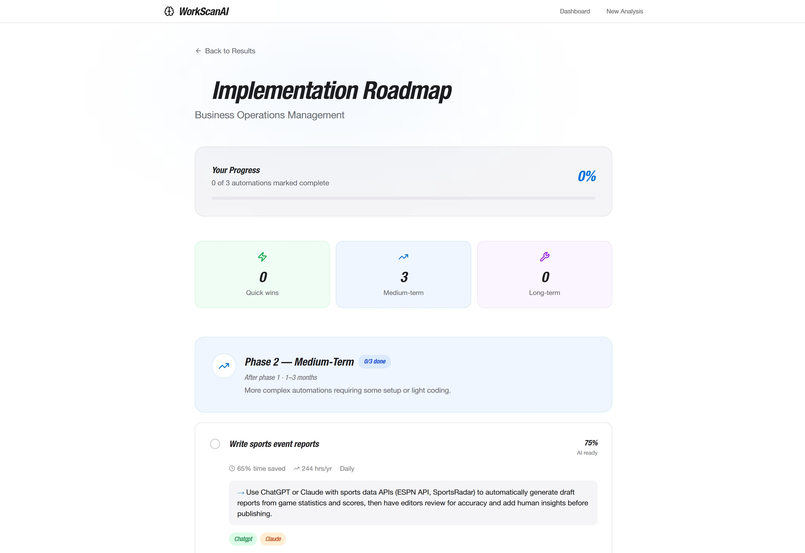

<div align="center">

**WorkScanAI - AI-Powered Workflow Analysis for the Age of Automation**


*Submit your team's workflow → get a ranked automation plan with real ROI numbers in under 5 minutes.*


</div>


🌐 **Live:** [workscanai.vercel.app](https://workscanai.vercel.app) &nbsp;·&nbsp; **Repo:** [github.com/ibxibx/workscanai](https://github.com/ibxibx/workscanai)

[](https://www.python.org/)
[](https://nextjs.org/)
[](https://react.dev/)
[](https://www.typescriptlang.org/)
[](https://fastapi.tiangolo.com/)
[](https://www.anthropic.com/)
[](#localization-en--de)
[](LICENSE)
</div>


---

<details>
<summary><strong>📑 Contents</strong> — click to expand</summary>

- [Demo](#demo) · [Screenshots](#screenshots) · [Sample Reports](#sample-reports)
- [The Problem](#the-problem) · [The Solution](#the-solution) · [Value Proposition](#value-proposition)
- [Key Features](#key-features)
  — Input & Data Capture · Core Analysis Engine · Role-Based Output · Automation & n8n Export · Reporting, Sharing & Retention · Growth, SEO & Discovery · Localization · Security, Privacy & Compliance · Analytics & Admin
- [Tech Stack](#tech-stack) · [Architecture](#architecture)
- [Analysis Intelligence](#analysis-intelligence)
- [Authentication](#authentication)
- [Database: Turso (libSQL)](#database-turso-libsql)
- [Input Modes](#input-modes)
- [Shareable Reports](#shareable-reports)
- [Export Reports (PDF + DOCX)](#export-reports-pdf--docx)
- [Admin Dashboard](#admin-dashboard)
- [Localization (EN / DE)](#localization-en--de)
- [Privacy, Consent & Analytics](#privacy-consent--analytics)
- [Growth & SEO Surfaces](#growth--seo-surfaces)
- [Project Structure](#project-structure)
- [Getting Started](#getting-started)
- [Deployment](#deployment)
- [Key Engineering Lessons](#key-engineering-lessons)
- [Example Output](#example-output)
- [Contributing](#contributing)
- [License](#license)

</details>

---

## Demo

**The future of work starts with knowing what to automate.**
**WorkScanAI analyzes your team's workflows and identifies automation opportunities in minutes, not months.**
<div align="center">

**Submit or describe your workflow, and get an instant, valuable and full AI automation report in less than a minute!**

</div>

**Type any job title → AI researches the role → scores every task for automation readiness → generates ROI, roadmap, and ready-to-import n8n workflows — in under 45 seconds.**

</div>

---

## Screenshots

| Landing Page | Workflow Input (Text, Voice, Document) |
|:---:|:---:|
|  |  |
| **Analysis Results & ROI** | **Implementation Roadmap** |
|  |  |

---

## Sample Reports

Curious what a full WorkScanAI report actually looks like? Have a look — three real, complete analyses pulled straight from production, each for a different profession:

- <a href="https://raw.githubusercontent.com/ibxibx/workscanai/main/sample-reports/WorkScanAI_Sample_Report_HR_Recruiting.pdf" target="_blank" rel="noopener noreferrer"><span style="font-size:1.8em; vertical-align:middle; line-height:1;">📄</span> <strong>HR & Recruiting</strong></a> — 82% automation score · €7,426/yr saved · 149 hours reclaimed
- <a href="https://raw.githubusercontent.com/ibxibx/workscanai/main/sample-reports/WorkScanAI_Sample_Report_Legal_Compliance.pdf" target="_blank" rel="noopener noreferrer"><span style="font-size:1.8em; vertical-align:middle; line-height:1;">📄</span> <strong>Legal & Compliance</strong></a> — 79% automation score · €10,540/yr saved · 210 hours reclaimed
- <a href="https://raw.githubusercontent.com/ibxibx/workscanai/main/sample-reports/WorkScanAI_Sample_Report_Marketing_and_Sales.pdf" target="_blank" rel="noopener noreferrer"><span style="font-size:1.8em; vertical-align:middle; line-height:1;">📄</span> <strong>Marketing and Sales</strong></a> — 69% automation score · €12,790/yr saved · 256 hours reclaimed (18 tasks, 26-page deep-dive with career pivot analysis)

These are the genuine, full-length PDF export — cover KPIs, AI Readiness Assessment, per-task scoring and recommendations, Implementation Roadmap, and the role-specific strategy section included, nothing trimmed for the demo. Want to see more? There are real samples across 10 industries at [workscanai.vercel.app/templates](https://workscanai.vercel.app/templates).

---

## The Problem

An Oxford-educated mathematician who built AI models downloaded by 300 million people says: within 900 days, any job you can do on a screen will be automatable for €1,000/year.

Companies face a critical question:

> *Which of our tasks can be automated today, and what is the actual ROI?*

Most organisations have no systematic way to answer this. WorkScanAI answers it in minutes, not months — and tells you exactly where each task sits on the automation countdown.

---

## The Solution

Submit your team's tasks via **voice recording**, **document upload**, or **manual entry**.
Receive a scored automation assessment, concrete ROI projection, phased implementation roadmap, and a decision-layer breakdown distinguishing what AI can automate from what requires irreplaceable human judgment — then export it as a polished DOCX or PDF report.

---

## Value Proposition

With the help of **WorkScanAI** — plus my **personal free consultation** (at your disposal, whenever you'd like it) for a custom-tailored implementation of a workflow automation — you get the following, depending on who you are:

- **<u>Individuals / Independent Professionals</u>** — Accelerate your workflow and cut down on time-consuming work. Benefit from cutting-edge automation tools to free up more time and keep growing.
- **<u>Small Businesses / Startups</u>** — Find new ways to be more productive and less dependent on legacy systems and their limitations. Explore viable new paths for your business and benefit from innovative workflow automations that support and propel it forward.
- **<u>Medium Businesses / Scale-Ups</u>** — Unlock and leverage the power of AI and technology to smartly consolidate and optimize your daily workflows, reduce costs, strengthen your daily operations, deliver more value to your clients, and meaningfully reduce overhead while mitigating risk.

---

## Key Features

35+ shipped features, grouped by function — jump to a category or scroll straight through.

<h3 align="center">📥 Input & Data Capture</h3>
<p align="center"><em>How work gets into the system.</em></p>

| Feature | Description |
|---|---|
| 🎙️ **Voice Input** | Record tasks verbally — Web Speech API transcribes in real time |
| 📄 **Document Upload** | Parse PDFs, Word, Excel, PowerPoint, images (20+ formats) via Claude Vision OCR |
| ✍️ **Manual Entry** | Type tasks directly with dynamic add/remove controls |
| 🔍 **Job Scanner** | Enter a job title — Tavily web-searches the role, Claude extracts tasks and context automatically |

<h3 align="center">🧠 Core Analysis Engine</h3>
<p align="center"><em>Runs on every submission, regardless of who's asking.</em></p>

| Feature | Description |
|---|---|
| 🤖 **AI-Readiness Scoring** | 0–100% composite score per task: Repeatability, Data Access, Error Tolerance, Integration |
| 🧩 **Decision Layer Analysis** | Explicitly flags tasks requiring human judgment vs fully automatable — no oversimplification |
| ⚡ **900-Day Countdown Clock** | Per-task urgency: Automate NOW / 12–24 mo / 24–48 mo / Safe 48+ months |
| 🧠 **Human Edge Score** | Per-task irreplaceability score — what AI cannot replace |
| 💰 **ROI Calculator** | Annual savings (€), hours reclaimed/yr, FTE equivalent, payback period |
| 🗺️ **Implementation Roadmap** | Phased plan: quick wins → medium-term → strategic (3 phases with milestones) |
| 🤖 **Agentification Roadmap** | Phase 1: Human-in-Loop → Phase 2: Supervised → Phase 3: Full Delegation per task |
| ⚙️ **Orchestration Blueprint** | Multi-agent pipeline description per automatable task |
| 🛡️ **Risk & Compliance Flags** | Flags tasks with PII, financial, legal, or compliance concerns |
| 📡 **Live Analysis Progress** | `/api/analyze` streams real progress over SSE (analyzing → ROI → n8n → done); falls back to plain JSON automatically on older deploys |

<h3 align="center">🎯 Role-Based Output</h3>
<p align="center"><em>Same task list, different report — tailored to who's reading it.</em></p>

| Feature | Applies To | Description |
|---|---|---|
| 🎯 **Career Pivot Plan** | Individual | Skills to develop + adjacent lower-risk roles |
| 🚀 **90-Day Sprint Plan** | Team / Startup | Highest-ROI quick wins prioritised for first sprint |
| 📊 **Board-Ready Summary** | Company / Dept | Copy-paste executive memo with savings, FTE, and 90-day recommendation |
| 🏆 **Industry Benchmark** | Company / Dept | Your score vs sector average (58%) vs AI-first top 10% (81%) |
| 🏢 **AI-First Competitor Gap** | Company / Dept | Cost of inaction — what a competitor gains if they move first |
| 👥 **Headcount Signal** | Company / Dept | FTE equivalent freed, redeployment recommendation |

<h3 align="center">⚙️ Automation & n8n Export</h3>
<p align="center"><em>Turning the analysis into something that actually runs.</em></p>

| Feature | Description |
|---|---|
| ⚙️ **n8n Workflow Download** | Every Job Scanner result includes a ready-to-import n8n canvas — one column per task, real trigger→process→output chains, downloadable as JSON |

<h3 align="center">📊 Reporting, Sharing & Retention</h3>
<p align="center"><em>Getting the analysis in front of the right people — and back in front of them again.</em></p>

| Feature | Description |
|---|---|
| 📥 **Export Reports** | Full PDF + DOCX with all sections — complete parity with the web dashboard |
| 🔗 **Shareable Reports** | Public `/report/{code}` URL with auto-generated OG image for LinkedIn sharing |
| 📊 **Visual Dashboard** | All analyses with aggregate stats, euro savings, combined report download |
| 🛡️ **Legal & Accuracy Disclaimer** | Standardised disclaimer footer on every report surface (web, PDF, DOCX) |
| 📧 **Email-Gated Full Report** | Visitors can unlock the full PDF + n8n export by email — captured as a named lead |
| ⏰ **Quick-Win Retention Digest** | Daily cron emails report-gate leads their single highest-ROI quick win 3 days after they viewed a report |

<h3 align="center">🌐 Growth, SEO & Discovery</h3>
<p align="center"><em>Public surfaces built to bring people in.</em></p>

| Feature | Description |
|---|---|
| 🔎 **Programmatic SEO Hub** | `/automatable` — per-role automation breakdowns (marketing manager, bookkeeper, recruiter, SDR, support agent…) for organic + GEO discovery |
| 🗂️ **Industry Sample Gallery** | `/templates` — public pre-built sample reports across verticals, indexed via `sitemap.ts` |

<h3 align="center">🌍 Localization</h3>
<p align="center"><em>One product, two languages.</em></p>

| Feature | Description |
|---|---|
| 🌍 **Bilingual (EN/DE)** | Full German translation — landing, scanner, dashboard, reports, PDFs, and transactional emails, toggled by a 3D flag switch |

<h3 align="center">🔐 Security, Privacy & Compliance</h3>
<p align="center"><em>Protecting users, visitors, and the site itself.</em></p>

| Feature | Description |
|---|---|
| 🔐 **Magic Link Auth** | Email OTP authentication via 4-digit CSPRNG code — no passwords, brute-force locked after 5 attempts |
| ⚡ **Rate Limiting** | DB-backed daily cap per IP + per email, with reCAPTCHA v3 and an owner/admin bypass |
| 🍪 **GDPR/TTDSG Cookie Consent** | Explicit opt-in banner gates all non-essential analytics; Privacy Policy + Impressum pages |

<h3 align="center">📈 Analytics & Admin Operations</h3>
<p align="center"><em>The owner's view of what's happening across the product.</em></p>

| Feature | Description |
|---|---|
| 📈 **Dual Analytics Stack** | PostHog product analytics (consent-gated) + a first-party, privacy-safe page-view tracker (hashed IPs, no cookie needed) |
| 🗺️ **Admin Geo Dashboard** | Country/city traffic breakdown with rolling 1/3/6-month windows, `/admin` → Geo tab |
| 🔥 **Cold-Start Warming** | Frontend pings the Render backend and shows a "waking up" state instead of a blank error on free-tier cold starts |
| 🛠️ **Admin Dashboard** | `/admin` — usage stats, geo breakdown, all submissions, result links, user table, backfill + rate-limit reset tools |

---

## Tech Stack

| Layer | Technology | Purpose |
|---|---|---|
| **Frontend** | Next.js 16 (App Router), React 19, TypeScript, Tailwind CSS 4 | SSR, client components, edge routes |
| **Backend** | Python 3.11, FastAPI 0.115 | REST API, SSE streaming, AI orchestration |
| **AI / LLM** | Anthropic Claude — `claude-haiku-4-5` (analysis), `claude-sonnet-4` (extraction) | Batched task scoring, structured extraction, Vision OCR |
| **Database** | Turso (libSQL cloud SQLite) | Persistent cloud SQLite — survives Render redeploys, free forever |
| **Auth** | Resend (transactional email) + custom CSPRNG OTP | Magic link / 4-digit OTP email flow, brute-force locked |
| **Search** | Tavily Search API | Real job-posting research for the Job Scanner |
| **Analytics** | PostHog (client, consent-gated) + first-party tracker (`app/api/routes/track.py`) | Product analytics + privacy-safe geo traffic reporting |
| **Reports** | ReportLab (PDF), python-docx (DOCX) | Full-featured export with all analysis sections, bilingual EN/DE |
| **i18n** | Custom cookie-based locale layer (`frontend/src/i18n`) | Dependency-free EN/DE translation across app, PDFs, and emails |
| **Deployment** | Vercel (Next.js frontend) + Render (FastAPI backend) | Frontend on Vercel, long-running backend on Render |
| **OG Images** | Next.js `ImageResponse` (edge runtime) | Auto-generated share cards per report |

### Architecture

```
Browser
  │
  ├── /api/*  →  Next.js proxy route  →  Render FastAPI backend
  │                                        (workscanai.onrender.com)
  │
  ├── /dashboard, /report/*  →  Next.js (Vercel)
  │
  └── Long-running calls (>10s) bypass Vercel proxy entirely:
       POST /api/analyze       →  direct to Render (25–31s)
       POST /api/parse-tasks   →  direct to Render (15–27s)
       POST /api/extract-tasks →  direct to Render (variable)
```

**Why this split:** Vercel serverless functions have a 10-second hard limit on the Hobby tier. The AI analysis endpoint takes 25–31 seconds for 6+ tasks. Those three routes call Render directly from the browser to bypass the Vercel timeout — all other endpoints go through the Next.js proxy as normal.

### Live Progress via SSE
`POST /api/analyze` streams real progress over Server-Sent Events instead of leaving the user staring at a spinner for 25–31 seconds:

1. Client requests with `Accept: text/event-stream`
2. Backend emits staged events as they actually happen: `analyzing` → `roi` → `n8n` → `done` (with a `: ping` heartbeat every 15s to keep the connection alive through proxies)
3. Frontend advances a real progress modal in lock-step with each stage
4. If the deployed backend doesn't support SSE yet (or the client requests plain JSON), the endpoint transparently falls back to a single synchronous response — fully backward compatible

### Cold-Start Warming
The Render free tier spins the backend down after inactivity, causing the first request to hang for 20–50s. `wake-ping.ts` fires a warm-up ping as soon as the page loads, and `BackendWarming.tsx` shows an explicit "waking up the server" state on the dashboard, results, roadmap, and public report pages instead of a raw fetch error.

---

## Analysis Intelligence

### Scoring System (F1)
Each task is scored across four dimensions, combined into a composite score:

| Sub-score | Weight | What it measures |
|---|---|---|
| **Repeatability** | 30% | How rule-based and consistent the task is |
| **Data Availability** | 30% | Whether inputs are structured and accessible |
| **Error Tolerance** | 20% | Cost of AI mistakes — **deliberately low (25–55) for strategic tasks** |
| **Integration** | 20% | How easily automation plugs into existing tools |

### Decision Layer Analysis
Inspired by feedback from a product manager at n8n, the analysis explicitly separates:

- **`none`** — Fully automatable. AI handles it end-to-end.
- **`partial`** — AI handles data prep and surfaces options; human makes the final call.
- **`full`** — Human judgment required throughout. Implicit org knowledge, trade-offs, stakeholder politics.

Strategic tasks (backlog prioritisation, stakeholder alignment, product strategy) are scored honestly — they should rarely exceed 70% composite score. The recommendation for these tasks explicitly states *"AI surfaces [X], human decides [Y] given [constraints]"* rather than just listing tools.

### Context-Aware Output
The same task list produces completely different output depending on the analysis context:

| Context | Unique Sections |
|---|---|
| **Individual** | Automation Countdown Clock, Human Edge Score per task, Career Pivot Plan (skills + roles + 90-day plan) |
| **Team / Startup** | Team Velocity Impact, FTE equivalent, Rollout Timeline, 90-Day Sprint Plan |
| **Company / Dept** | AI-First Competitor Gap, Headcount Signal, Industry Benchmark, Board-Ready Executive Summary |

All contexts also receive: Task Breakdown (F1 sub-scores), Risk Flags (F3), AI Readiness Assessment (F4), Agentification Roadmap (F9), Orchestration Blueprint (F13).

### Agentification Phases (F9)
Every task is mapped to an automation maturity phase:

- **Phase 1 — Human-in-Loop:** AI drafts, human reviews and approves
- **Phase 2 — Supervised:** AI handles with periodic human validation
- **Phase 3 — Full Delegation:** Zero manual intervention, fully automated pipeline

---

## Authentication

WorkScanAI uses a **magic link / OTP email flow** — no passwords:

1. User enters their email address
2. A 4-digit OTP is sent via **Resend** transactional email (English or German, based on locale)
3. User enters the code in a 4-box OTP input (paste, auto-advance, backspace, auto-submit)
4. Session stored in `localStorage` — persists across tabs and page refreshes

**Security hardening:**
- OTP codes are generated with `secrets.choice` (CSPRNG) — not `random`, which is predictable
- Verification uses `secrets.compare_digest` / `hmac.compare_digest` — constant-time, no timing side-channel
- Brute-force lock: 5 failed attempts per email within the 15-minute code TTL locks further attempts until a new code is requested
- Admin auth (`x-admin-secret`) is centralized in one module (`app.core.auth`) — fails closed (rejects everything) if the secret is unset, instead of falling back to a hardcoded default

**Rate limiting:** Daily analysis cap enforced per IP *and* per signed-in email (DB-backed, not just in-memory), plus optional reCAPTCHA v3 scoring on the analyze form. The site owner and admin (`x-admin-secret`) bypass the cap entirely — matched against `OWNER_IP`, which supports exact IPs, ISP-block prefixes (`84.59.*`), or a full wildcard for local dev.

---

## Database: Turso (libSQL)

Production uses **Turso** — a cloud-hosted libSQL (SQLite-compatible) service that:
- Survives Render redeploys (unlike SQLite on-disk which gets wiped)
- Is free forever on the Turso free tier
- Is accessed via a custom Python DBAPI shim (`backend/app/core/turso_dbapi.py`)

The shim translates SQLAlchemy queries into Turso's HTTP pipeline API, handling:
- Transaction buffering (`BEGIN`/`COMMIT` → atomic pipeline batch)
- Float serialisation (must be JSON number, not string)
- Connection pooling and retry logic

**Local development** falls back to SQLite automatically when `DATABASE_URL` starts with `sqlite://`.

---

## Input Modes

### Document Upload (20+ formats)
Supported via `backend/app/api/routes/extraction.py`:

| Category | Formats |
|---|---|
| Text | `.txt`, `.md`, `.rst`, `.rtf`, `.csv`, `.tsv`, `.json`, `.xml`, `.html`, `.yaml`, `.log` |
| Documents | `.pdf`, `.docx`, `.doc`, `.odt` |
| Spreadsheets | `.xlsx`, `.xls`, `.xlsm`, `.ods` |
| Presentations | `.pptx`, `.ppt` |
| Images (OCR) | `.png`, `.jpg`, `.jpeg`, `.gif`, `.webp`, `.bmp`, `.tiff`, `.heic`, `.svg`, `.ico` |

Images are processed via Claude Vision API (OCR). All other formats use native Python libraries.

### Job Scanner (Tavily + Claude Pipeline)
Enter any job title and optionally an industry. The two-step pipeline (split to stay within Vercel's 60s limit):

**Step 1 — Research** (`POST /job-scan/research`, ~15–20s):
1. **Tavily Search API** fetches real job posting content for the role from across the web
2. **Claude Haiku** extracts: responsibilities list, required tools/skills, and infers the most likely analysis context (Individual / Team / Company)
3. Returns a structured task list — pre-fills the analysis form, editable before submission

**Step 2 — Analyze + Save** (`POST /job-scan/analyze`, ~30–40s):
1. Runs the full batch AI analysis (same pipeline as the standard workflow analyzer)
2. Generates and persists an **n8n automation canvas** (see below)
3. Saves the workflow to DB, returns `workflow_id` + `share_code` for redirect

Both endpoints share the same 5/24h rate limit (IP + email) as the standard analyzer. Both are called directly from the browser to Render (bypass Vercel proxy — they exceed the 10s serverless limit).

### n8n Workflow Generation

Every Job Scanner result includes a **downloadable n8n workflow JSON** — a single importable canvas covering all extracted tasks.

**Architecture:**
- `N8nTemplateClient` (`backend/app/services/n8n_template_client.py`) builds the canvas from **purpose-built workflow patterns** per task category — not the n8n community search API (confirmed broken: returns the same 10 templates for every query regardless of search terms)
- **40+ task categories** mapped from task descriptions: `reporting`, `scheduling`, `communication`, `data_entry`, `research`, `analysis`, `customer_support`, `sales`, `marketing`, `hr`, `finance`, `devops`, `legal`, `content`, `product`, `seo`, `social_media`, `ecommerce`, `logistics`, `procurement`, `security`, `healthcare_admin`, `investor_relations`, and more
- Claude Haiku curates which patterns are most relevant for the specific job title before building

**Canvas format:**
- One merged `.json` file per scan — directly importable into any n8n instance via **File → Import**
- Full-width header sticky note (colour 7) with job title and generation timestamp
- One column per task (1000px horizontal spacing)
- Per-task coloured sticky note above each column
- Real trigger → process → output node chains (not placeholders)
- Correct n8n node types and `typeVersion` numbers — validated against n8n's schema
- Valid `connections` dict format

**Download:** available as a button on the Job Scanner results page — returns the JSON directly, browser saves as `{job_title}_n8n_workflows.json`.

### LinkedIn Import
Paste a LinkedIn profile or company page URL. Claude Haiku infers the role context from the URL slug + any pasted text. If the user pastes their headline and current position description, the extraction is highly accurate. Without pasted text, a generic professional context is generated with a prompt to add more detail.

---

## Shareable Reports

Every analysis generates a unique 6-character share code (e.g. `/report/4m5gd9`):

- **Public page** — no auth required, full task breakdown visible
- **OG image** — auto-generated 1200×630 PNG at `/report/{code}/opengraph-image` with:
  - Score-coloured background glow (green/amber/red based on automation score)
  - Large automation percentage, annual savings, hours/yr, quick wins count
  - Context badge (Personal / Team / Company)
  - Countdown urgency label ("⚡ Act now — within 12 months")
  - Blue CTA card with `workscanai.vercel.app`
- When pasted to LinkedIn, Twitter, or Slack — the card auto-renders as a rich preview
- A standardised **legal/accuracy disclaimer** renders at the bottom of every report surface — web, PDF, and DOCX

### Email-Gated Full Report + Lead Capture
Visitors on a public `/report/{code}` page can unlock the full PDF report and the n8n export by entering their email:

- `POST /reports/{share_code}/email` captures the visitor as a named lead (`ReportLead`) **before** attempting to send — so a lead is never lost even if the email delivery fails
- The full PDF (bilingual, EN/DE) is generated on demand and sent as an email attachment via Resend
- `EmailGateCard.tsx` renders the gate on the report page; `WalkthroughCta.tsx` offers a guided next step after unlock

### Quick-Win Retention Digest
A daily cron job (`POST /cron/quick-win-digest`, secured by `x-admin-secret`) finds report leads captured ~3 days earlier who haven't yet received a follow-up, picks the single highest-ROI *easy* task from their report, and emails it as a gentle nudge — turning a one-time report view into a second touch.

---

## Export Reports (PDF + DOCX)

Both PDF and DOCX reports have **full parity with the web dashboard**. Every section that appears on the results page also appears in the download.

### PDF Report Structure
1. **Cover** — branding, context label, workflow name, source text, hero KPIs (score, savings, hours, tasks), HIGH/MEDIUM/LOW task counts
2. **AI Readiness Assessment** — overall score + Data Quality, Process Clarity, Tool Maturity, Error Tolerance
3. **Detailed Task Analysis** — all tasks sorted by score, each with: description, frequency, time/task, category, difficulty, annual savings, F1 sub-scores, recommendation (Option 1 + Option 2), risk flag, agentification phase + milestone + pipeline
4. **Implementation Roadmap** — Phase 1/2/3 with task lists and hours saved
5. **Context-specific sections** (Individual / Team / Company — see above)
6. **Conclusion** with 5 actionable next steps

### Task Numbering Fix
Task numbers 10–27 previously rendered vertically ("1" on top of "0"). Fixed by widening the number column to 20mm with font-size 18 — all multi-digit numbers now render correctly on one line.

### Career Pivot Section (Individual)
Always rendered — falls back to sensible default skills (AI prompt engineering, strategic planning, etc.) if the AI didn't return pivot data for a specific analysis.

---

## Admin Dashboard

Available at `/admin` (password-protected via `x-admin-secret` header, constant-time comparison, fail-closed if unset):

- **Stats** — total users, workflows, analyses, tasks, average automation score
- **Context breakdown** — analyses by Individual / Team / Company
- **Input mode breakdown** — manual / voice / document / LinkedIn
- **Traffic & referral breakdown** — sourced from the first-party page-view tracker
- **Geo dashboard** — `GET /admin/geo` — country + city traffic with visitor counts and percentages, filterable to the last 1/3/6 months or all-time; shows the full long tail, no top-N cap
- **User table** — all registered emails with workflow counts
- **All submissions** — every workflow with expandable task names, source text, and direct links:
  - `results ↗` → `/dashboard/results/{id}` (full authenticated results page)
  - `share ↗` → `/report/{share_code}` (public shareable link)
- **Maintenance tools** — `POST /admin/backfill-n8n/{id}` and `POST /admin/backfill-confidence/{id}` to regenerate data on older workflows; `POST /admin/reset-rate-limits` to manually clear a rate-limited IP/email during testing or support

---

## Localization (EN / DE)

WorkScanAI ships a full, dependency-free bilingual experience — not machine-translated on the fly, but hand-translated and wired through every surface:

- **Cookie-based locale** (`wsai_locale`) — no routing changes, no `[locale]` segments; a lightweight custom layer (`frontend/src/i18n/`) reads the cookie server- and client-side
- **Coverage** — landing page, `/scan`, `/templates`, the full report (task breakdown, badges, AI-readiness, all three context sections, n8n section), dashboard, auth (OTP request/verify), the `/automatable` role hub, admin chrome, 404/error pages, transactional emails (OTP + report email), and both the PDF and DOCX report generators
- **3D flag toggle** — a physical-feeling language switch component (`LanguageToggle.tsx`) in the site header
- **Locale-aware formatting** — currency and hour units render per-locale in both the web UI and generated reports
- English stays the canonical/SEO surface (metadata, canonical URLs); German is a full parallel translation layer for the visible UI

---

## Privacy, Consent & Analytics

- **GDPR (Art. 6(1)(a)) / German TTDSG (§25) compliant cookie consent** — a banner (`CookieConsent.tsx`) gates all non-essential tracking behind explicit opt-in; the decision is stored client-side and broadcast via a `CustomEvent` so `PostHogProvider` and the banner itself react immediately. A "Cookie settings" footer link lets visitors withdraw consent at any time.
- **Privacy Policy** (`/privacy`) and **Impressum** (`/impressum`) pages for German legal compliance
- **PostHog** — consent-gated product analytics + session insights (`posthog-js` on the client, a Python client server-side for backend events)
- **First-party page tracking** (`POST /api/track`) — a lightweight, privacy-conscious alternative that never blocks or fails the caller: resolves country/region/city from IP (via a free geo API), stores only a **salted SHA-256 hash of the IP** (never the raw address), and feeds the admin Geo dashboard. Designed to degrade silently — a tracking failure never affects the visitor's experience.

---

## Growth & SEO Surfaces

Two public, unauthenticated content surfaces built for organic search *and* GEO (generative engine optimization — Bing's index feeds ChatGPT/Copilot answers, so the same pages help there too):

| Route | Purpose |
|---|---|
| `/automatable` | Programmatic hub linking to `/automatable/{role}` — a dedicated, crawlable page per role (marketing manager, bookkeeper, recruiter, support agent, SDR, and more) with a task-by-task automation breakdown and a CTA into the real scanner |
| `/templates` | Public gallery of pre-generated sample reports across industry verticals, each backed by a real `/report/{code}` |

Both are listed in `sitemap.ts` alongside static routes; `/admin`, `/auth`, and `/dashboard` are deliberately excluded as private/non-indexable. `robots.ts` and per-page `Metadata` (canonical URLs, Open Graph, Twitter cards) round out the SEO layer.

---

## Project Structure

```
workscanai/
├── backend/
│   ├── app/
│   │   ├── api/routes/
│   │   │   ├── workflows.py      # POST /workflows, POST /analyze (SSE + JSON), GET /results/{id}
│   │   │   │                     # GET /share/{code}, DB-backed rate limiting
│   │   │   ├── extraction.py     # POST /parse-tasks, POST /extract-tasks (Job Scanner),
│   │   │   │                     # POST /extract-linkedin, POST /transcribe
│   │   │   ├── job_scan.py       # POST /job-scan/research, POST /job-scan/analyze
│   │   │   │                     # GET /quota, POST /job-scan/n8n-templates
│   │   │   ├── reports.py        # GET /reports/{id}/pdf|docx, POST /reports/combined/{format}
│   │   │   │                     # POST /reports/{share_code}/email (gated report + lead capture)
│   │   │   ├── auth.py           # POST /auth/request, /auth/verify-otp — CSPRNG OTP + brute-force lock
│   │   │   ├── admin.py          # GET /admin/stats, /admin/geo, backfill + reset-rate-limits tools
│   │   │   ├── cron.py           # POST /cron/quick-win-digest — T+3 retention email
│   │   │   └── track.py          # POST /track — first-party privacy-safe page view tracking
│   │   ├── core/
│   │   │   ├── config.py         # Pydantic Settings — single source of truth for all secrets/env
│   │   │   ├── auth.py           # Centralized admin auth — constant-time compare, fail-closed
│   │   │   ├── database.py       # SQLAlchemy engine — Turso (prod) or SQLite (dev)
│   │   │   ├── turso_dbapi.py    # Custom Python DBAPI shim for Turso HTTP API
│   │   │   ├── security.py       # Rate limiting, owner-IP bypass, reCAPTCHA v3 verification
│   │   │   └── posthog_client.py # Server-side PostHog event capture
│   │   ├── models/
│   │   │   └── workflow.py       # ORM: User, MagicToken, Workflow, Task, Analysis,
│   │   │                         # AnalysisResult (inc. decision_layer), ReportLead, PageView
│   │   ├── schemas/
│   │   │   └── workflow.py       # Pydantic schemas — all fields inc. decision_layer
│   │   ├── services/
│   │   │   ├── ai_analyzer.py    # Batched Claude API call — all tasks in ONE request
│   │   │   │                     # Decision-layer scoring rules, strategic task calibration
│   │   │   ├── n8n_template_client.py    # Purpose-built n8n canvas per task category
│   │   │   ├── n8n_workflows_extended.py # Extended builder library — 40+ categories total
│   │   │   ├── job_scanner.py    # JobScanner service — Tavily search + Claude task extraction
│   │   │   └── report_generator.py # PDF (ReportLab) + DOCX (python-docx) — bilingual, full parity
│   │   └── main.py               # FastAPI app, CORS, route registration
│   ├── tests/                    # pytest — analyzer, n8n canvas, job scanner, security, SSE streaming
│   └── requirements.txt
│
├── frontend/
│   └── src/
│       ├── app/
│       │   ├── page.tsx                        # Landing page + workflow input form
│       │   ├── scan/page.tsx                   # Job Scanner
│       │   ├── templates/page.tsx              # Public industry sample-report gallery
│       │   ├── automatable/                    # Programmatic SEO role hub (hub + [slug] pages)
│       │   ├── dashboard/
│       │   │   ├── page.tsx                    # Dashboard — analyses, aggregate stats
│       │   │   └── results/[id]/
│       │   │       ├── page.tsx                # Results — all sections, badges, exports
│       │   │       └── roadmap/page.tsx        # Phased implementation roadmap
│       │   ├── report/[code]/
│       │   │   ├── page.tsx                    # Public share page (no auth)
│       │   │   ├── EmailGateCard.tsx            # Email-gated full report unlock
│       │   │   ├── WalkthroughCta.tsx           # Post-unlock guided next step
│       │   │   └── opengraph-image.tsx         # Auto-generated OG card (edge runtime)
│       │   ├── auth/page.tsx                   # Email + 4-digit OTP login
│       │   ├── admin/page.tsx                  # Admin dashboard (stats, geo, tools)
│       │   ├── privacy/page.tsx, impressum/page.tsx  # GDPR/TTDSG legal pages
│       │   ├── sitemap.ts, robots.ts           # SEO — programmatic sitemap of all indexable routes
│       │   └── api/[...path]/route.ts          # Catch-all Vercel proxy → Render
│       ├── components/
│       │   ├── WorkflowForm.tsx                # All input modes, context selector, SSE progress
│       │   ├── CookieConsent.tsx               # GDPR/TTDSG consent banner
│       │   ├── LanguageToggle.tsx              # 3D flag EN/DE switch
│       │   ├── PostHogProvider.tsx             # Consent-gated PostHog init
│       │   ├── BackendWarming.tsx              # Cold-start "waking up" UI state
│       │   └── report/                         # N8nWorkflowsSection, ReportSections
│       ├── i18n/                               # Cookie-based EN/DE locale layer (config, client, server, messages)
│       └── lib/
│           ├── auth.tsx                        # useAuth hook — email from localStorage
│           ├── consent.ts                      # Cookie-consent state + CustomEvent bus
│           └── wake-ping.ts                    # Backend warm-up ping on page load
│
├── vercel.json                  # Cron: keep-alive ping to Render every 5 days
├── render.yaml                  # Render deployment config
└── docker-compose.yml           # Local full-stack dev
```

---

## Getting Started

### Prerequisites

- Python 3.11+
- Node.js 18+
- An [Anthropic API key](https://console.anthropic.com/)
- A [Tavily API key](https://tavily.com/) for the Job Scanner (optional — only needed for that feature)
- A [Resend API key](https://resend.com/) for email OTP
- A [Turso](https://turso.tech/) database (free tier) — or skip and use local SQLite
- Optional: [PostHog](https://posthog.com/) project keys for analytics, [reCAPTCHA v3](https://www.google.com/recaptcha/about/) keys for bot protection

### Backend Setup

```bash
cd backend
python -m venv venv
venv\Scripts\activate        # Windows
# source venv/bin/activate   # macOS / Linux
pip install -r requirements.txt
```

Create `backend/.env` (see `backend/.env.example` for the authoritative list):
```env
ANTHROPIC_API_KEY=sk-ant-...
TAVILY_API_KEY=tvly-...          # Job Scanner web research
RESEND_API_KEY=re_...
FROM_EMAIL=noreply@workscanai.com
APP_URL=https://workscanai.vercel.app

# Admin — generate with: python -c "import secrets; print(secrets.token_urlsafe(32))"
# Empty = every admin/cron endpoint fails closed (rejects all requests).
ADMIN_SECRET=your-admin-password

# Owner rate-limit bypass — exact IP, prefix ("84.59.*"), or "*" for local dev
OWNER_IP=

# Bot protection
MAX_ANALYSES_PER_HOUR=5
RECAPTCHA_SECRET_KEY=
RECAPTCHA_MIN_SCORE=0.5

# Production (Turso):
TURSO_DATABASE_URL=libsql://your-db.aws-eu-west-1.turso.io
TURSO_AUTH_TOKEN=eyJ...

# Local dev (SQLite — falls back automatically when Turso vars are unset):
DATABASE_URL=sqlite:///C:/absolute/path/outside/project/workscan.db
# ⚠️ Path must be OUTSIDE the project directory — SQLite inside triggers
#    Next.js/Turbopack infinite rebuild loops on every DB write.

# PostHog server-side analytics (optional)
POSTHOG_API_KEY=phc_...
POSTHOG_HOST=https://eu.i.posthog.com

CORS_ORIGINS=http://localhost:3000,https://yourapp.vercel.app
```

```bash
uvicorn app.main:app --reload --port 8000
```

### Frontend Setup

```bash
cd frontend
npm install
```

Create `frontend/.env.local`:
```env
NEXT_PUBLIC_API_URL=http://localhost:8000
API_URL=http://localhost:8000
# On Vercel, set both to: https://workscanai.onrender.com

# Long-running endpoints call Render directly, bypassing the Vercel proxy — see below
NEXT_PUBLIC_BACKEND_URL=http://localhost:8000

# Optional
NEXT_PUBLIC_RECAPTCHA_SITE_KEY=
NEXT_PUBLIC_POSTHOG_KEY=
NEXT_PUBLIC_POSTHOG_HOST=https://eu.i.posthog.com
```

```bash
npm run dev   # http://localhost:3000
```

---

## Deployment

### Render (Backend)
The FastAPI backend runs as a **web service** on Render:

1. Connect the GitHub repo, root directory `backend`
2. Build command: `pip install -r requirements.txt`
3. Start command: `uvicorn app.main:app --host 0.0.0.0 --port $PORT`

**Environment variables** — set via the Render dashboard or API:
```
ANTHROPIC_API_KEY, TAVILY_API_KEY, RESEND_API_KEY, FROM_EMAIL, APP_URL,
ADMIN_SECRET, OWNER_IP, RECAPTCHA_SECRET_KEY,
TURSO_DATABASE_URL, TURSO_AUTH_TOKEN, CORS_ORIGINS,
POSTHOG_API_KEY, POSTHOG_HOST
```

> ⚠️ Never use the Render dashboard's "Environment" editor to save vars — it replaces ALL vars on each save. Use the Render REST API (`PUT /v1/services/{id}/env-vars`) instead.

**Free tier keep-alive:** `vercel.json` includes a cron job that pings `GET /api/keep-alive` every 5 days at 9am UTC to prevent Render from spinning down the service.

### Vercel (Frontend)

1. Import the GitHub repo
2. **Root directory:** leave blank (not `frontend`) so `vercel.json` is respected
3. **Build command:** `cd frontend && npm install && npm run build`
4. **Output directory:** `frontend/.next`

**Environment variables on Vercel:**
```
NEXT_PUBLIC_API_URL=https://your-render-service.onrender.com
NEXT_PUBLIC_BACKEND_URL=https://your-render-service.onrender.com
NEXT_PUBLIC_RECAPTCHA_SITE_KEY=...
NEXT_PUBLIC_POSTHOG_KEY=...
NEXT_PUBLIC_POSTHOG_HOST=https://eu.i.posthog.com
```

### Long-Running Endpoint Workaround
Three endpoints bypass the Vercel proxy because they exceed the 10s serverless limit:

| Endpoint | Typical duration | Strategy |
|---|---|---|
| `POST /api/analyze` | 25–31s | Called directly from browser to Render |
| `POST /api/parse-tasks` | 15–27s | Called directly from browser to Render |
| `POST /api/job-scan/research` | 15–20s | Called directly from browser to Render |
| `POST /api/job-scan/analyze` | 30–40s | Called directly from browser to Render |
| `POST /api/extract-tasks` | variable (doc upload) | Called directly from browser to Render |

This is handled in `WorkflowForm.tsx` using `NEXT_PUBLIC_BACKEND_URL`.

---

## Key Engineering Lessons

Hard-won insights from building this project.

| Problem | Root Cause | Fix |
|---|---|---|
| Infinite Turbopack rebuild loops | SQLite DB inside the project dir — every DB write triggers Next.js file watcher | Move DB to an absolute path outside the project |
| `Unexpected token 'I', "Internal S"...` — JSON crash | Frontend called `.json()` on plain-text error responses | `safeJson()` helper reads as text first, tries JSON.parse, falls back to `{detail: rawText}` |
| POST requests returning 503 `TypeError: fetch failed` | Vercel proxy forwarded original `content-length` header which didn't match re-buffered body | Strip `content-length` / `accept-encoding` from forwarded headers; recompute from actual buffer |
| Turso `400 Bad Request` on INSERT | SQLAlchemy wraps writes in `BEGIN…COMMIT`; old shim sent bare `COMMIT` → Turso 400 | Full transaction buffering in `turso_dbapi.py` — queue statements, flush as atomic pipeline batch |
| Turso float serialisation error | `_to_args()` encoded floats as `{"type":"float","value":"73.9"}` — Turso requires JSON number | `"value": float(v)` not `str(v)` |
| 504 on `/api/analyze` | Vercel Hobby tier hard-kills at 10s regardless of `maxDuration` — analysis takes 25–31s | Call Render directly from browser, bypass Vercel proxy entirely |
| CORS 405 on OPTIONS preflight | FastAPI CORS middleware wasn't handling OPTIONS before routing | Explicit `@app.options("/{rest_of_path:path}")` handler + hardcode Vercel origins |
| Task numbers 10–27 display vertically in PDF | Number column was 14mm wide — too narrow for two digits at font-size 22 | Widen number column to 20mm, reduce font to 18 |
| Career Pivot section missing from PDF | Section was wrapped in `if pivot_tasks:` — silently skipped when AI returned no pivot data | Always render section with fallback default skills |
| React StrictMode double API calls | StrictMode double-mounts components in dev, resetting `useRef` guards | Disable StrictMode in `next.config.ts` during development |
| Render env vars silently wiped | Render dashboard "Save" replaces ALL vars atomically | Use Render REST API (`PUT /v1/services/{id}/env-vars`) for any env var changes |
| Vercel `vercel.json` ignored | Root directory was set to `frontend` in Vercel dashboard | Clear root directory; set explicit build commands |
| Hardcoded admin-secret fallback (a backdoor) | Three route files each defined their own `_require_admin` and read `ADMIN_SECRET` via scattered `os.getenv` calls, so one copy drifted to a literal fallback | Centralize into one `require_admin` dependency (`app.core.auth`) backed by typed `Settings` — fails closed when unset, constant-time compare |
| `/admin/backfill-confidence` returned Turso `500` | Route read `workflow.confidence` for the JSON response *after* `db.commit()` — Turso's HTTP-pipeline session had already detached the object | Snapshot the response fields into local variables *before* calling `commit()` |
| 4-digit OTP crackable in a live session | Codes were TTL-limited but not attempt-limited — 10,000 combinations is brute-forceable inside 15 minutes | Track failed attempts per email in-memory, lock after 5 within the TTL window until a new code is requested |
| Dashboard/results/roadmap 403'd on a fresh session | Authenticated routes had no recovery path if the session email didn't match the workflow owner (e.g. after a logout/login) | Recover access via the workflow's public `share_code` instead of hard-failing to a dead end |
| First page load after Render cold-start looked broken | No visual difference between "still loading" and "backend is down" on a 20–50s free-tier wake-up | `wake-ping.ts` fires an early warm-up request; `BackendWarming.tsx` renders an explicit "waking up" state instead of a raw error |
| Analysis calls timed out on Render's free tier | Each task was sent to Claude as a separate sequential API call — N tasks meant N round-trips | Batch every task into ONE Claude API request per analysis |

> Looking for implementation detail behind any feature above? Every category has its own deep-dive section further down — Analysis Intelligence, Input Modes, Admin Dashboard, Localization, Privacy & Analytics, Growth & SEO Surfaces. Use the **📑 Contents** dropdown at the top of this file to jump straight there.

---

## Example Output

**Input:** n8n Product Manager (27 daily tasks, Company context)

**Result:** 62% automation score · €23,855/yr saved · 795 hours reclaimed · 0.4 FTE equivalent

**Per-task highlights:**
- *Triage Slack messages* — 89% AI Ready, ⚡ Automate NOW, Phase 2: Supervised
- *Prioritise product backlog* — 56% AI Ready, Decision Layer: partial — "AI scores items by data signals, PM decides given strategic context"
- *Write PRDs* — 63% AI Ready, 🧩 Decision Layer: full — "AI drafts structure, PM provides strategic intent and domain expertise"
- *Attend engineering standup* — 35% AI Ready, 48+ months, not automatable (synchronous human attendance)

**Board-ready summary auto-generated**, industry benchmark (62% vs 58% sector average vs 81% AI-first), competitor gap (€23,855/yr advantage if you act now vs €33,397 disadvantage if competitor moves first).

---

## Contributing

Contributions welcome — open an issue first to discuss.

**Enhancement ideas:**
- Recharts visualisations — donut score chart, effort/impact priority matrix
- Integration with Jira / Asana — import tasks directly from project management tools
- Real-time collaboration via WebSockets — teams analyse workflows together
- Playwright E2E tests — automated coverage of critical user journeys
- React Native mobile app — share components with the web version
- Chrome extension — capture repetitive tasks directly from any web app
- Additional locales beyond EN/DE, built on the existing i18n layer
- Fine-tuning on company-specific workflow data

> ✅ Already shipped since the ideas above were first listed: SSE live-progress streaming, and full EN/DE localization — see [Analysis Intelligence](#analysis-intelligence) and [Localization](#localization-en--de).

### Planned & Tested — Not Currently Active

These features were fully built and tested but pulled from the live product pending further refinement:

| Feature | Status | Notes |
|---|---|---|
| 🔗 **LinkedIn Import** | Built & tested | Paste a LinkedIn profile URL or raw text — Claude extracts role, tasks, and context automatically. Removed from active input modes; code preserved in `WorkflowForm.tsx`. Planned for re-activation with a dedicated scraping/proxy layer. |
| 🔍 **Job Scanner** | ✅ Live | Paste any job posting URL — Tavily fetches the page, Claude Haiku extracts tasks and sets context. Available as a tab in `WorkflowForm`. Rate-limit pre-flight check fires before any background work begins. |

---

## License

MIT — see [LICENSE](LICENSE).

---

<div align="center">

Built by [Ian Baumeister](https://ianworks.dev) &nbsp;·&nbsp; [LinkedIn](https://linkedin.com/in/avoiann) &nbsp;·&nbsp; [GitHub](https://github.com/ibxibx)

**⭐ Star this repo if you find it useful!**

</div>
